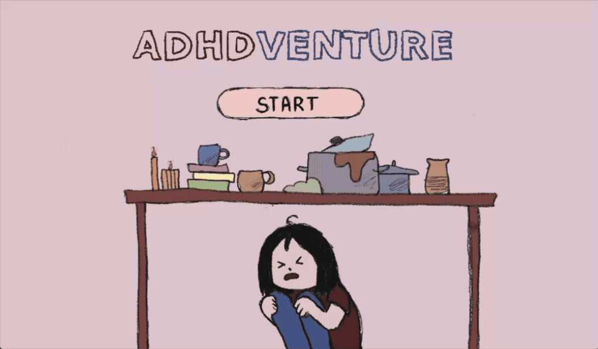

# ⋆✴︎˚｡⋆ ADHDventure ⋆✴︎˚｡⋆

<p align="center">
  </img>
</p>

**ADHDventure** is a 2D life simulation and adventure game prototype that explores the daily experience and mental load of navigating life with ADHD. 

Expect to get a little frustrated! This is my very first game project. It has plenty of room for improvement and will likely evolve over time. 


## Play the Game!

You don't need to download the code to play. The game is fully playable in your browser via HTML5 on itch.io:

**[Play ADHDventure on itch.io](https://olhasolodovnyk.itch.io/adhdventure)**

## Project Structure

This project was built using the **Godot Engine**. 

* `scenes/` - Contains the visual scenes and UI elements of the game.
* `assets/` - Sprites, graphics, and visual resources.
* `sounds/` - Audio effects and background music.
* `project.godot` - The main configuration file for the Godot Engine.
* `*.tres` - Custom font themes and environment resources.

## Running the Project Locally

If you want to explore the source code or tinker with the game mechanics:

1. **Install Godot:** Ensure you have the [Godot Engine](https://godotengine.org/download/) installed (Godot 3.x).
2. **Clone the repository:**
   ```bash
   git clone [https://github.com/maybe-im-a-mess/adhd_venture.git](https://github.com/maybe-im-a-mess/adhd_venture.git)
   ```
3. **Import to Godot:** * Open the Godot Project Manager.
   * Click **Import** and navigate to the cloned `adhd_venture` folder.
   * Select the `project.godot` file.
4. **Play:** Hit the play button inside the editor to run the game locally!

## Feedback & Suggestions

Since this is my first game and a work in progress, I would love your feedback. If you encounter bugs or have ideas for new features, please let me know!

---
*Developed with love, focus, and a little bit of chaos.*
